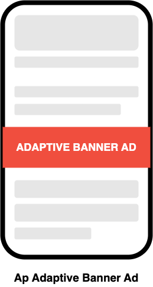
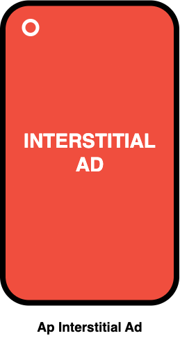
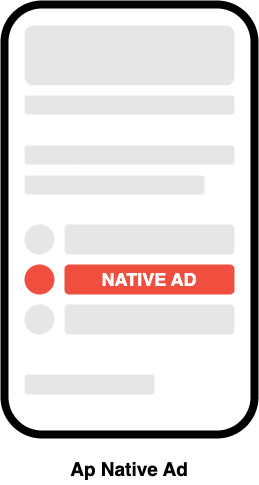
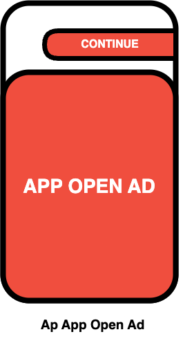
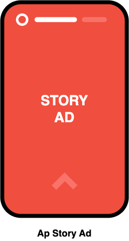

# Getting Started Guide

# **Get started**

**Release version: 2.0.2 | Release date: 20.05.2025**

Follow this guide to get started with Ap Mobile SDK.

The Ap Mobile SDK allows you to add multiple demand sources in your app and makes them compete against each other in real-time auctions, maximizing your ad revenues. 

The following document shows how to integrate Ap Mobile SDK in your Android App.

You can use our demo apps as a reference project.

<aside>
📎 Demo Apps Link: https://github.com/adpushup/ApMobileSDKDemo

</aside>

---

## Before you begin

To prepare your app, complete the steps in the following sections.

### **App prerequisites**

- Use Android Studio Dolphin (2021.3.1) or higher
- Make sure that your app's build file uses the following values:
    - A `minSdkVersion` of `21` or higher
    - A `compileSdkVersion` of `34` or higher
- Requires java 17 or higher
- **(Important)** Get the following IDs from AdPushup:
    - **Ad Manager App Id**: For Android Manifest File.
    - **Ap App Id**: Used in initializing Ap Mobile SDK.
    - **Ap Placement Ids**: Each Ad Unit has a unique placement Id.

---

## Configure your app

1. In your Gradle settings file, include the [Google's Maven repository](https://maven.google.com/web/index.html), [Maven central repository](https://search.maven.org/artifact), and [Jitpack.io repository](http://jitpack.io/), normally `settings.gradle`:
    
    ```groovy
    pluginManagement {
        repositories {
            google()
            mavenCentral()
            maven { url 'https://jitpack.io' }
            gradlePluginPortal()
        }
    }

    dependencyResolutionManagement {
    repositoriesMode.set(RepositoriesMode.FAIL_ON_PROJECT_REPOS)
        repositories {
            google()
            mavenCentral()
            maven { url 'https://jitpack.io' }
        }
    }

    rootProject.name = "My Application"
    include ':app'
    ```
    
2. Add the dependencies for the **Ap Mobile SDK** and **Google Mobile Ads SDK** to your module's app-level [Gradle](https://gradle.org/) file, normally `app/build.gradle`:
    
    ```groovy
    dependencies {
      implementation 'com.adpushup:apmobilesdk:2.0.2'
      implementation 'com.google.android.gms:play-services-ads:23.2.0'
    }
    ```
    
3. Add your **Ad manager app ID** (provided by AdPushup) to your app’s `AndroidManifest.xml` file. To do so, add a `<meta-data>` tag with `android:name="com.google.android.gms.ads.APPLICATION_ID"`. For `android:value`, insert your own **Ad manager app ID**, surrounded by quotation marks.
    
    ```xml
    <manifest>
        <application>
            <!-- Ad Manager app ID will be provided by AdPushup -->
            <meta-data
                android:name="com.google.android.gms.ads.APPLICATION_ID"
                android:value="ca-app-pub-xxxxxxxxxxxxxxxx~yyyyyyyyyy"/>
        </application>
    </manifest>
    ```
    

---

## **Initialize the Ap Mobile SDK**

Before loading ads, have your app initialize the Ap Mobile SDK by calling `ApMobileSdk.init()` which initializes the SDK and calls back a completion listener once initialization is complete. This needs to be done only once, ideally at the app launch.

**Ads may be preloaded by the Ap Mobile SDK upon calling** `ApMobileSdk.init()`. If you need to obtain consent from users in the European Economic Area (EEA), or otherwise take action before loading ads, ensure you do so before initializing the Ap Mobile SDK.

Here's an example of how to call the `init()` method in an Activity:

*Kotlin Example:*

```kotlin
import com.adpushup.apmobilesdk.ApMobileSdk

class MainActivity : AppCompatActivity() {
    override fun onCreate(savedInstanceState: Bundle?) {
        super.onCreate(savedInstanceState)
        setContentView(R.layout.activity_main)
				
	    // apAppId is your app ID in AdPushUp. It will be provided to you by AdPushup.
        ApMobileSdk.init(this, "apAppId")
    }
}
```

*JAVA Example:*

```java
import com.adpushup.apmobilesdk.ApMobileSdk;

public class MainActivity extends AppCompatActivity {
    @Override
    protected void onCreate(@Nullable Bundle savedInstanceState) {
        super.onCreate(savedInstanceState);
        setContentView(R.layout.activity_main);

        // apAppId is your app ID in AdPushUp. It will be provided to you by AdPushup.
        ApMobileSdk.init(this, "apAppId");
    }
}
```
### **(Important) Additinal Steps - For Proper SDK Functioning**

Ap Mobile Sdk may try to preload ads when app resumes from background or user navigates between multiple screens. To keep ads preloaded so that they can be shown instantly, you must call `ApMobileSdk.resume()` method.

Here's an example of how to call the `resume()` method in an Activity:

*Kotlin Example:*

```kotlin
import com.adpushup.apmobilesdk.ApMobileSdk

class MainActivity : AppCompatActivity() {
    override fun onResume() {
        super.onResume()
        // Inform Sdk about Activty's Resume Event
        ApMobileSdk.resume(this)
    }
}
```

*JAVA Example:*

```java
import com.adpushup.apmobilesdk.ApMobileSdk;

public class MainActivity extends AppCompatActivity {
    @Override
    protected void onResume() {
        super.onResume();
        // Inform Sdk about Activty's Resume Event
        ApMobileSdk.resume(this);
    }
}
```

---


# Implementing ads to your app

| Ad Format                                           | Description                                                                  | Example Image                                     |
|-----------------------------------------------------|------------------------------------------------------------------------------|---------------------------------------------------|
| [Banner Ads](BannerAdExample/README.md)             | A standard rectangular ad displayed at the top or bottom of screen.          |          |
| [Adaptive Banner Ads](AdaptiveBannerAdExample/README.md) | A banner that dynamically adjusts its size to fit different screens.         |  |
| [Interstitial Ads](InterstitialAdExample/README.md) | Full-screen ads shown at natural transition points in your app.              |  |
| [Rewarded Ads](RewardedAdExample/README.md)         | Full-screen Video ads that reward users with in-app items or currency for watching.      |      |
| [Rewarded Interstitial Ads](RewardedInterstitialAdExample/README.md) | Rewarded Ad format that lets you offer rewards for ads that appear automatically during natural app transitions. |  |
| [Native Ads](NativeAdExample/README.md)             | Ads that blend seamlessly with your app’s UI for a non-disruptive feel.      |          |
| [In-Stream Ads](InstreamAdExampleWithApExoPlayer/README.md) | Video ads served within your app’s video content stream.                     |  |
| [ApVideo](ApVideoExample/README.md)                 | A flexible video ad unit that can be placed anywhere in your app, with built-in playlist and ad delivery for seamless in-stream monetization.             |              |
| [App Open Ads](AppOpenAdExample/README.md)          | Ads displayed when users return to your app.                       |       |
| [ApStory Ads](ApStoryAdExample/README.md)             | Story/Reels Format ads integrated into your app’s story/reels type UI flows.           |          |

---

# Extras
## Looking for a Plug-and-Play Solution?

Try our [Ap Mediation SDK](mediation/README.md) — a seamless mediation adapter for AdMob. It integrates effortlessly with your existing AdMob ad stack, requiring minimal setup while maximizing monetization potential.

---

# Debugging Tools

Ap SDK provides ```ApMobileSdk.enableDebugging()``` function to enable debugging logs for the SDK. Once enabled, SDK will print debug Logs in your Android Studio's Logcat.

Its advisable to only enable debugging in Test environments. You must disable debugging after completing the tests.

Here's an example of how to call the `enableDebugging()` method in an Activity:

*Kotlin Example:*

```kotlin
import com.adpushup.apmobilesdk.ApMobileSdk

class MainActivity : AppCompatActivity() {
    override fun onCreate(savedInstanceState: Bundle?) {
        super.onCreate(savedInstanceState)
        setContentView(R.layout.activity_main)

        // Enable Debugging
        ApMobileSdk.enableDebugging(this, true)

		// Initialise SDK		
	    ApMobileSdk.init(this, "apAppId")
    }
}
```

*JAVA Example:*

```java
import com.adpushup.apmobilesdk.ApMobileSdk;

public class MainActivity extends AppCompatActivity {
    @Override
    protected void onCreate(@Nullable Bundle savedInstanceState) {
        super.onCreate(savedInstanceState);
        setContentView(R.layout.activity_main);

        // Enable Debugging
        ApMobileSdk.enableDebugging(this, true);

		// Initialise SDK		
        ApMobileSdk.init(this, "apAppId");
    }
}
```