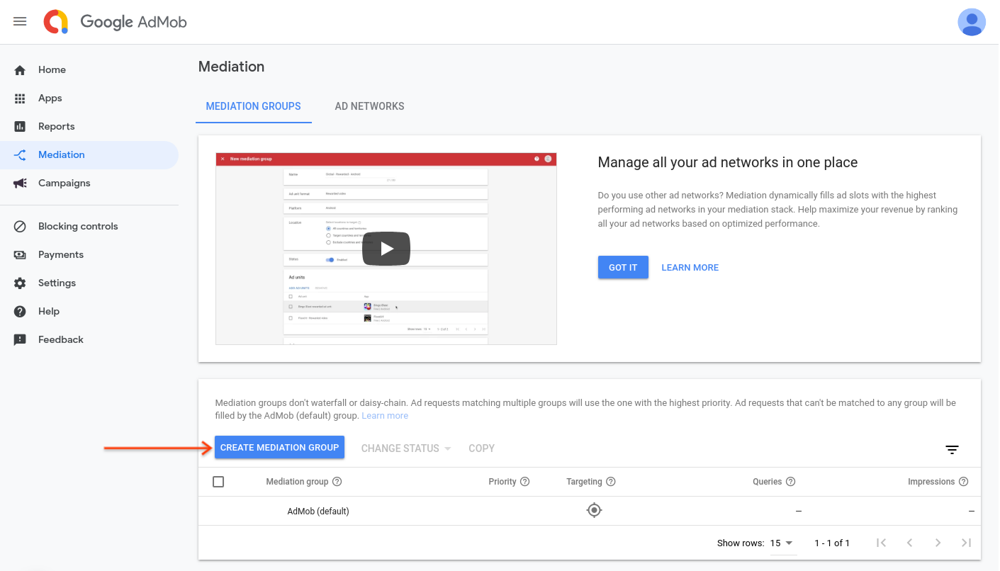
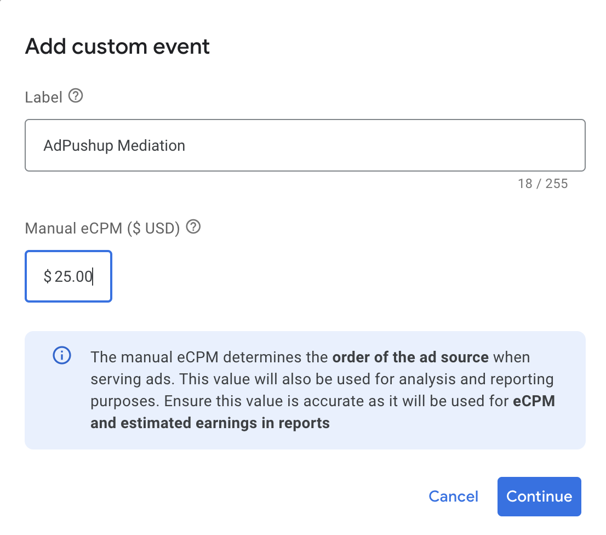
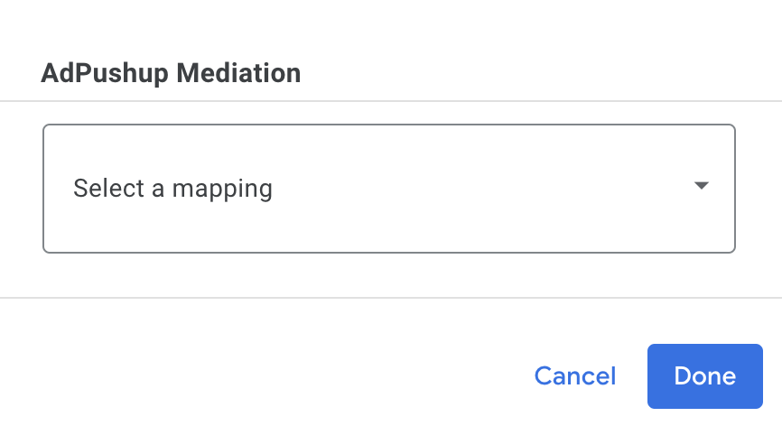
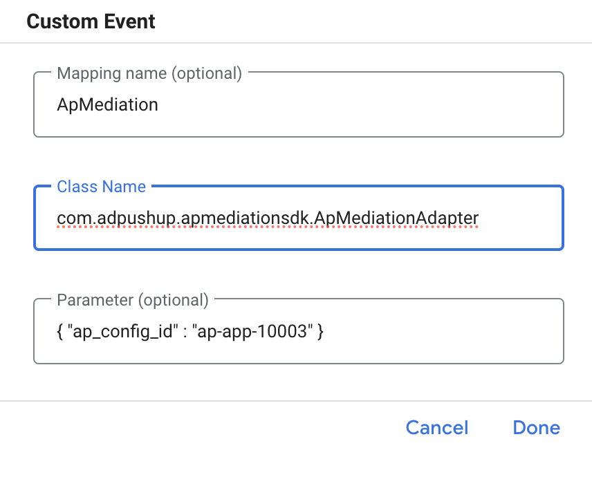

# Ap Mediation SDK - Documentation

**Ap Mediation SDK** lets app developers easily integrate and optimize multiple ad networks inside their mobile apps—without needing to install several separate SDKs⁠.

Here is a quick implementation guide that covers waterfall integration and shows you how to use Ap Mediation SDK based on if you are using [GAM Mediation](https://developers.google.com/ad-manager/mobile-ads-sdk/android/mediation) or [AdMob Mediation](https://developers.google.com/admob/android/mediation).

# Table of Contents

# AdMob Mediation

If you are using [AdMob Mediation](https://developers.google.com/admob/android/mediation) then follow these steps:

## Setup Guide:

### **A. Set up AdPushup demand in AdMob UI:**

Configure mediation settings for your ad unit:

1. First, sign in to your [AdMob account](https://apps.admob.com/). Next, navigate to the **Mediation** tab. 
2. To create a new mediation group, select **Create Mediation Group**.
    
    
    
3. Enter your ad format to Interstitial and platform to Android, then click **Continue**.
    
    
    
4. Give your mediation group a name, and select locations to target. Next, set the mediation group status to **Enabled**, and then click **Add Ad Units**.
    
    
    
5. Associate this mediation group with one or more of your existing AdMob ad units. Then click **Done**.
    
    
    
6. You should now see the ad units card populated with the ad units you selected:
    
    
    
7. **Under Waterfall,** Click on the **ADD CUSTOM EVENT** Button, Select a Label Name and a manual eCPM > $1 and then select continue.
    
    
    
8. Under `AdPushup Mediation` (Label that you created), 
    1. Click on Select a mapping > Add Additional Mapping
    
    
    
9. Fill the Custom Event Details as follows and Select Done:
    
    Class Name: `com.adpushup.apmediationsdk.ApMediationAdapter`
    
    Parameter: `{ "ap_config_id" : "ap-app-10003" }` (Example Only, Will be different for each app.)
    
    
    
10. Save the newly created group and make its priority accordingly.

### **B. Set up AdPushup’s Ap Mediation SDK in your App:**

For Flutter App:

- Add [Ap Mediation SDK](https://pub.dev/packages/ap_mediation_sdk) to your app by running:
    
    ```bash
    flutter pub add ap_mediation_sdk
    ```
    

For React Native App:

- Add [Ap Mediation SDK](https://www.npmjs.com/package/@adpushup/ap-mediation-sdk) to your app by running:
    
    ```bash
    npm install @adpushup/ap-mediation-sdk
    ```
    

For Native Android App:

- Add the dependencies to your module's app-level Gradle file, normally `app/build.gradle`:
    
    ```groovy
    dependencies {
      implementation 'com.adpushup:apmediationsdk:2.0.2'
    }
    ```
    

# GAM Mediation

If you are using [GAM Mediation](https://developers.google.com/ad-manager/mobile-ads-sdk/android/mediation) then follow these steps:

## Setup Guide:

### A. Set up AdPushup as a Company on GAM

1. [Sign in](https://admanager.google.com/) to Google Ad Manager.
2. Click **Admin**, then **Companies**.
3. Click **New company**, then **Ad network**.
4. Specify a **unique name** (For example AdPushup Mediation) for this Ad Manager company to determine how it will appear in Ad Manager reports. 
5. Click **Select ad network** and choose "Other company”. 
6. Toggle **Mediation** to enable AdPushup to participate in App Mediation.
7. Click **Save**.

### **B. Set up AdPushup Demand in GAM**

Follow these steps to configure mediation for your interstitial ad unit (Same Steps for Rewarded Ads too):

1. [Sign in](https://admanager.google.com/) to Google Ad Manager.
2. Click **Delivery**, then **Yield groups**.
3. Click the name of the yield group you'd like to edit. (You can add a new Yield Group if needed by clicking on the **New yield group** button).
4. Click **Add yield partner**.
5. Select the yield partner from the **Yield partner** dropdown (That you created in Stage A).
6. Select **integration type** to **Custom event.**
7. Select the **Platform** to **Android.**
8. (Optional) Select Ad Units on which you want to run AdPushup Ads.
9. Set **Status** to **Active**.
10. Enter a **Default CPM** value. (Optionally select override **Override Dynamic CPM**)
11. Under "Additional yield partner details, fill in:
    - **Label**: Enter a name for the custom event to be used in reporting.
    - **Class Name**: `com.adpushup.apmediationsdk.ApMediationAdapter`
    - **Parameter**: `{ "ap_config_id" : "ap-app-20101" }` (The ID will be unique for each app)
12. Click **Save and activate** to save and activate the Setup.

### **C. Set up AdPushup Mediation Lib in your app:**

For Flutter App:

- Add [Ap Mediation SDK](https://pub.dev/packages/ap_mediation_sdk) to your app by running:
    
    ```bash
    flutter pub add ap_mediation_sdk
    ```
    

For React Native App:

- Add [Ap Mediation SDK](https://www.npmjs.com/package/@adpushup/ap-mediation-sdk) to your app by running:
    
    ```bash
    npm install @adpushup/ap-mediation-sdk
    ```
    

For Native Android App:

- Add the dependencies to your module's app-level Gradle file, normally `app/build.gradle`:
    
    ```groovy
    dependencies {
      implementation 'com.adpushup:apmediationsdk:2.0.2'
    }
    ```
    

That’s all. Your app is ready to serve AdPushup Ads.